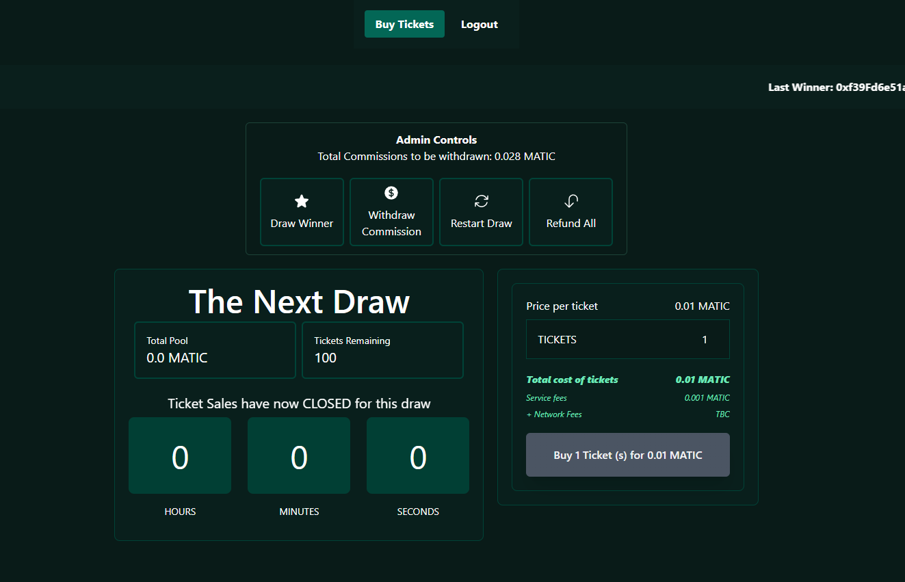

## 🎫 The Lottery DAPP

This **Lottery Dapp** is an implementation of basic lottery application where each individual can buy certain number of tickets, while the total amount of tickets purchased accumulate as the total prize pool for that time period

Hosted on Spheron - [Lottery DAPP](http://lottery-dapp-l92moj.spheron.app/)

---

### 📹 Preview



----

### 🛠 Tech Stack
* [Next.js](https://nextjs.org/) - Frontend Framework
* [thirdweb](https://thirdweb.com/) - Web3 Platform (`@thirdweb/react` & `@thirdweb/sdk`)
* [Tailwind CSS](https://tailwindcss.com/) - CSS Utility Framework

### 📐 Local Setup and Usage
* Make sure you have [*Metamask*](https://metamask.io/) installed as the extension in your browser 
* Clone the repository
* Install the required dependencies by using the following command in the project directory using your terminal
```bash
$ pnpm install
```
* Create `.env.local` file in your project directory and add the following variable(s)
```
NEXT_PUBLIC_LOTTERY_CONTRACT_ADDRESS=
```
The above contract address is of the Smart Contract version (*`contract/Lottery.sol`*) that is currently deployed to `thirdweb`
* Spin up the development server
```bash
$ npm run dev
```

